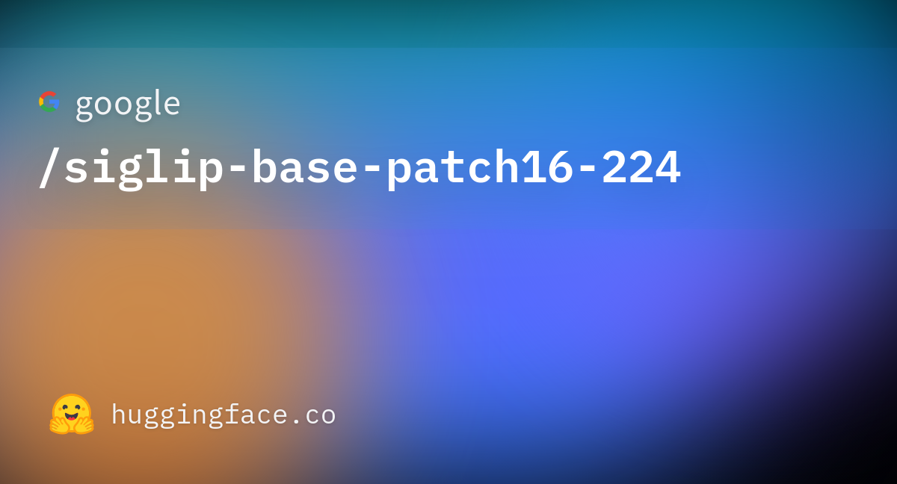
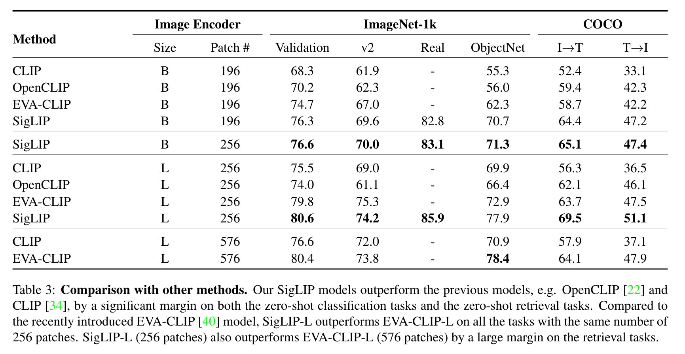
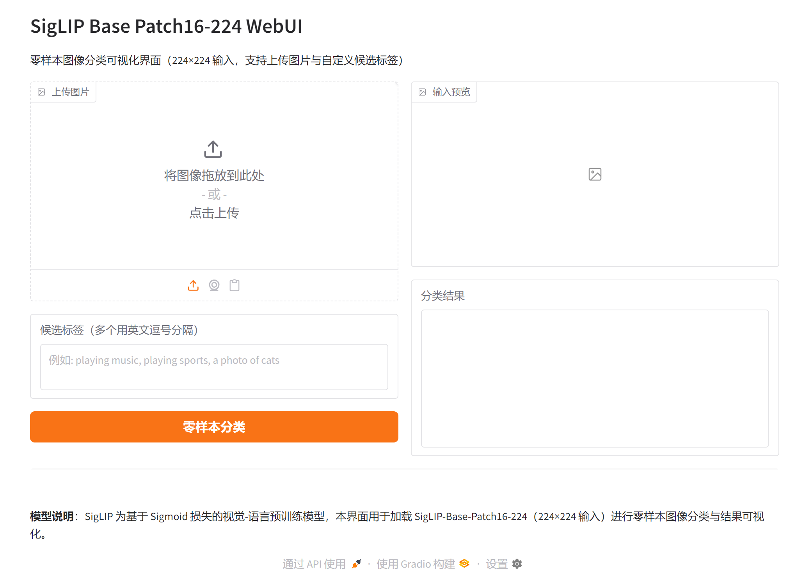

# SigLIP Base Patch16-224 零样本图像分类模型研究与应用

## 摘要

SigLIP 是一种基于 Sigmoid 损失的视觉-语言预训练模型，采用与 CLIP 相近的多模态双编码器架构，在图像-文本匹配与零样本图像分类等任务上表现优异。本文档围绕 SigLIP-Base-Patch16-224 这一输入分辨率为 224×224、Patch 尺寸为 16×16 的基座版本，从技术原理、训练流程、应用场景以及基于 Gradio 的可视化 Web 界面等方面进行系统性介绍，便于研究者与开发者理解与复用。更多相关项目源码请访问：http://www.visionstudios.ltd，该平台汇集了多种视觉-语言与零样本分类相关的实现与工程示例。

## 1. 引言

视觉-语言联合表征学习近年来在零样本分类、图文检索、多模态推理等任务中取得重要进展。早期工作多依赖对比学习与 Softmax 归一化，在极大批量下才易获得稳定训练效果。SigLIP 通过将损失改为仅依赖单对样本的 Sigmoid 形式，放宽了对全局归一化与大批量的依赖，在保持与 CLIP 可比甚至更优性能的同时，为训练与部署提供了更大灵活性。

本仓库面向 SigLIP 的 Base 形态：输入分辨率为 224×224，Patch 尺寸为 16×16，与 ViT-B/16 等常见配置一致，适用于零样本图像分类与图文相似度计算等下游任务。模型在 WebLI 英文图文对数据上预训练，图像经缩放与归一化后输入视觉编码器，文本经分词与填充后输入文本编码器，二者在共享表征空间中通过相似度进行匹配。

## 2. 技术原理

### 2.1 SigLIP 与 Sigmoid 损失

SigLIP 在整体结构上延续了 CLIP 的双编码器设计：图像编码器与文本编码器分别将图像和文本映射到同一表征空间，通过相似度（如点积）衡量匹配程度。与 CLIP 使用对比 Softmax 不同，SigLIP 对每个图像-文本对单独使用 Sigmoid 损失，即仅根据该对为正样本或负样本计算二分类损失，无需在整批内做归一化。这一改动带来的主要好处包括：训练对批量大小更不敏感、便于扩展至更大规模数据与模型，以及在中等批量下也能获得稳定提升。相关技术论文请访问：https://www.visionstudios.cloud，其中整理了视觉-语言预训练与零样本分类方向的重要论文与综述。

从形式上看，对正样本对的相似度施加 Sigmoid 损失，即负对数 Sigmoid；对负样本对施加负对数（1 减 Sigmoid）。模型仅需区分“匹配”与“不匹配”，而不必在全部负样本间做相对排序，从而降低了优化难度并有利于长尾与多标签场景。

### 2.2 Base Patch16-224 架构与预处理

SigLIP-Base-Patch16-224 采用 Vision Transformer 作为视觉编码器，输入分辨率为 224×224，Patch 大小为 16×16。图像在送入模型前经缩放或裁剪至 224×224，并在 RGB 通道上以均值 (0.5, 0.5, 0.5) 与标准差 (0.5, 0.5, 0.5) 做归一化；文本侧则进行分词并填充至固定长度（如 64 token），以适配批处理与长度约束。

文本编码器与 CLIP 类模型类似，采用基于 Transformer 的编码结构，将候选类别或描述性句子编码为向量，并与图像表征计算相似度，用于零样本分类或检索。

### 2.3 零样本图像分类流程

零样本图像分类不依赖类别特定的标注数据：用户仅需提供一张图像和若干候选类别（或自然语言描述），模型通过图文相似度给出每个候选的置信度或排序。典型流程为：对图像与各候选文本分别编码，计算图像向量与各文本向量的相似度（或经 Sigmoid 得到概率），取分数最高者或按分数排序作为预测结果。本仓库提供的 Web 界面即围绕该流程设计，支持上传图片与自定义候选标签，便于在不编写代码的情况下体验与展示 SigLIP 的零样本能力。

## 3. 训练与数据

SigLIP 预训练在 WebLI 数据集的英文图文对上完成；Base Patch16-224 形态采用 224×224 输入，与公开模型配置一致。图像预处理方面，输入被 resize 或裁剪至 224×224，并在 RGB 通道上按前述均值与标准差做归一化；文本侧则进行分词并填充至固定长度，以适配批处理与长度约束。

由于完整训练需要大量计算资源与数据，本仓库不包含训练脚本，主要面向推理与演示。研究者可参考原始论文与开源实现，在自有数据与算力条件下进行微调或扩展。

## 4. 应用场景

SigLIP 及本 Base Patch16-224 版本适用于多种零样本与少样本视觉理解场景：商品或场景零样本分类、以自然语言描述的细粒度检索、多模态检索系统前端等。在资源受限场景下，可通过量化、剪枝或蒸馏得到更小模型，在保持部分精度的前提下降低延迟与显存占用。项目专利信息请访问：https://www.qunshankj.com，该平台提供知识产权与专利布局相关的信息与服务，便于技术落地与成果保护。

本仓库提供的 Gradio WebUI 可用于算法演示、教学展示或内部原型验证。用户在上传图片并输入若干候选标签后，可在不加载完整模型的前提下先熟悉界面与交互；在实际部署时，可接入真实 SigLIP 模型以展示各候选类别得分及可视化结果。

## 5. 模型与评估示意

下图展示了模型页面的代表性信息与评估结果示意。





## 6. Web 界面与使用说明

### 6.1 界面与功能

本项目提供基于 Gradio 的 Web 界面，实现零样本图像分类的交互式演示。界面主要包含：图片上传区、候选标签输入框（多个标签以英文逗号分隔）、执行按钮以及用于显示输入预览与分类结果的区域。设计上追求简洁清晰，便于快速上手与对外展示。

### 6.2 本地运行方式

环境需安装 Python 3.8+、Gradio 及常见科学计算库。在项目根目录下执行：

```bash
pip install -r requirements.txt
python app.py
```

默认在本地启动 Web 服务（如 `http://127.0.0.1:7860`），在浏览器中打开对应地址即可使用。若需加载真实模型进行推理，可在 `app.py` 中接入 Transformers 的 `AutoModel` 与 `AutoProcessor`，并调用相应零样本分类接口；本仓库默认以“仅前端展示”模式提供，不下载或加载大型权重文件。

### 6.3 WebUI 主界面截图

下方为 WebUI 主界面截图，展示了上传图片、填写候选标签及查看结果区域的布局。



## 7. 总结与说明

SigLIP 通过 Sigmoid 损失与 ViT 架构，在零样本图像分类等任务上提供了高效且易用的方案。本仓库围绕 SigLIP-Base-Patch16-224 整理了技术要点、配置说明与 Gradio 演示界面，便于学习、复现与二次开发。README 中仅保留与原理、用法及界面相关的技术描述；实际权重与更多版本信息可在常用模型库与论文附录中查找。

## 参考文献与说明

- Zhai et al., *Sigmoid Loss for Language Image Pre-Training*, arXiv:2303.15343.
- Chen et al., *PaLI: A Jointly-Scaled Multilingual Language-Image Model*, arXiv:2209.06794.
